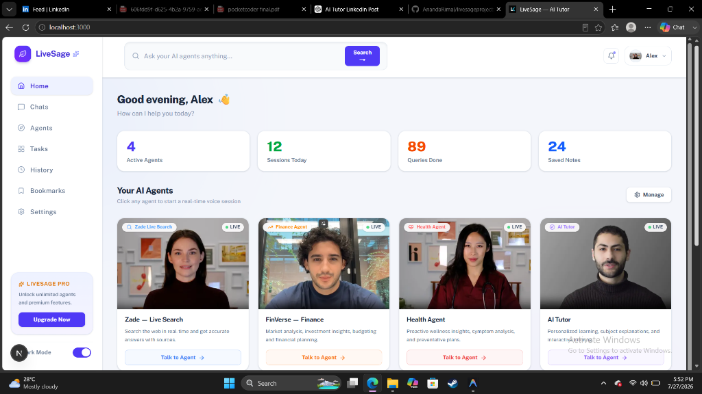

# LiveSage 🌿⚡

LiveSage is a digital workforce platform powered by AI employees and human-like AI agents that can automate tasks, assist workflows, and collaborate like real team members.

---



---

## 🤖 Building Human-Like AI Agents

At **LiveSage**, we build human-like AI agents designed to seamlessly collaborate, communicate, and work alongside humans with natural real-time voice, interactive visuals, and domain expertise. 

### Initial Domain AI Agents

We have initially launched with specialized AI agents across four core domains:

- 🔍 **LiveSearch (Search & Research)**: Real-time search and intelligence gathering agent providing instant answers, web research, and citation summaries.
- 🏥 **Health Agent**: Empathetic wellness assistant delivering proactive health insights, symptom analysis, and preventative wellness guidance.
- 📈 **Finance Agent (FinVerse)**: Intelligent market analysis agent performing real-time stock evaluation, financial forecasting, technical analysis, and portfolio tracking.
- 🎓 **AI Tutor**: Autonomous interactive learning agent offering step-by-step explanations, document-based problem solving, and personalized tutoring.

---

## 🔮 Platform Vision

Our vision for LiveSage is to continuously explore, innovate, and expand our digital workforce by building human-like AI agents for the most popular and useful domains required by both **B2C consumers** and **B2B enterprise companies**. 

Whether automating complex organizational workflows or serving end users in specialized fields, LiveSage aims to deploy domain-expert AI employees wherever automated human-like collaboration is needed.

---

## ⚡ Real-Time Infrastructure

LiveSage uses **LiveKit** for WebRTC real-time voice, video, and data communication, enabling low-latency, interactive human-agent conversations.

---

## 📁 Repository Structure

```
livesage/
├── frontend/               # Next.js Web Dashboard & Agents UI
├── my-agent/               # LiveKit Domain AI Agent Services
└── assets/                 # Platform screenshots and documentation media
```

---

## 🚀 Quick Start

### Prerequisites

- **Node.js** v18.0+
- **Python** 3.11+
- **LiveKit** Server or LiveKit Cloud project

---

### 1. Environment Setup

Configure your LiveKit credentials:

#### Backend (`my-agent/.env.local`)
```env
LIVEKIT_URL=wss://your-livekit-project.livekit.cloud
LIVEKIT_API_KEY=your_livekit_api_key
LIVEKIT_API_SECRET=your_livekit_api_secret
```

#### Frontend (`frontend/.env.local`)
```env
LIVEKIT_URL=wss://your-livekit-project.livekit.cloud
LIVEKIT_API_KEY=your_livekit_api_key
LIVEKIT_API_SECRET=your_livekit_api_secret
```

---

### 2. Run the AI Agents

```bash
cd my-agent
uv sync

# Run desired LiveKit domain agent
uv run python livesearch.py dev
# or: uv run python finance.py dev
# or: uv run python aitutor.py dev
```

---

### 3. Run the Web Application

In a separate terminal:

```bash
cd frontend
npm install
npm run dev
```

Access the dashboard at `http://localhost:3000`.

---

## 📝 License

This project is licensed under the MIT License.
